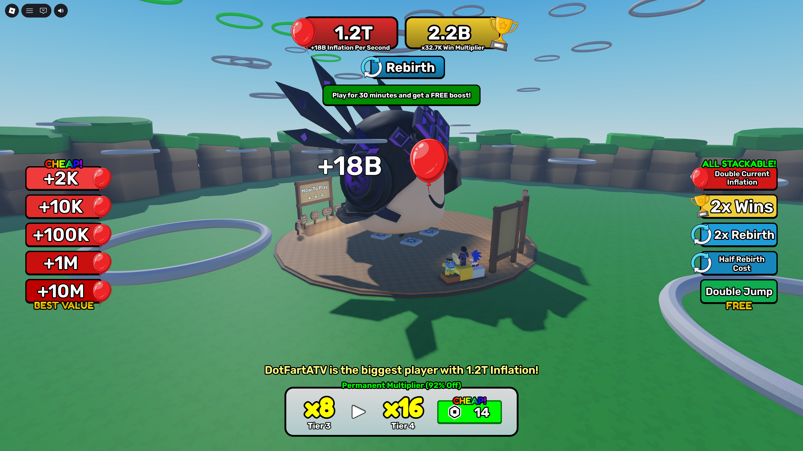

# Inflate Every Second

A Roblox incremental simulator where players grow their heads over time, unlock upgrades, and progress through increasingly difficult areas.

## About

Originally completed in August 2025.

Converted into a Rojo project to enable version control and showcase the source code.

## Gameplay

- Your head grows bigger every second.
- The bigger your head, the higher you jump.
- Jump through rings to earn points.
- Increase multipliers from rebirths and other upgrades.
- Try to reach the secret area at the top.

## Preview



## Link to Play

https://www.roblox.com/games/126016356585979/Inflate-Every-Second

## Features

- Persistent player data using Roblox DataStores
- Currency, upgrade, and rebirth progression systems
- Custom UI systems
- Global leaderboards
- Multiplayer gameplay loop

## Built With

- Roblox Luau
- Rojo
- Git

## Building from Source

To build the place from scratch, use:

```bash
rojo build -o "InflateEverySecond.rbxlx"
```

Next, open `InflateEverySecond.rbxlx` in Roblox Studio and start the Rojo server:

```bash
rojo serve
```

Built with [Rojo](https://github.com/rojo-rbx/rojo) 7.7.0.
